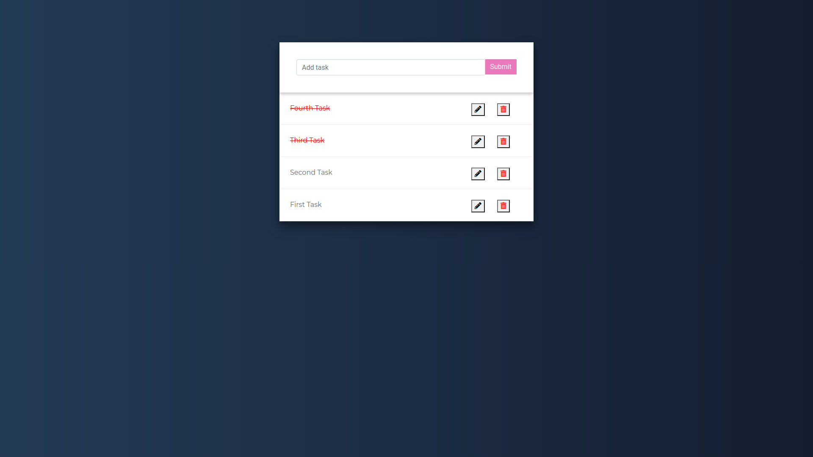

# Project Title

Todo App



## Getting Started

These instructions will get you a copy of the project up and running on your local machine for development and testing purposes.

### Prerequisites

- python3
- django
- djangorestframework

### Installing

After installing python and django follow the steps below

Clone or download the repository in your system

```
git clone https://github.com/AnjalDhakal/Todo-App
```
Go to the folder you have cloned then run the following code in your terminal

```
python manage.py runserver
```

Then go to https://localhost:8000/ in your browser, Its Done!


## Built With

* [Django](https://www.djangoproject.com/) - The web framework used
* [Django Rest Framework](https://www.django-rest-framework.org/) - The rest framework used
* [Bootstrap](https://getbootstrap.com/) - User Interface


## Versioning

We use [git](http://semver.org/) for versioning. For the versions available, see the [tags on this repository](https://github.com/AnjalDhakal/customer_relationship_management). 

## Author

* **Angel Dhakal** - *Initial work* - (https://github.com/AnjalDhakal/Todo-App)

